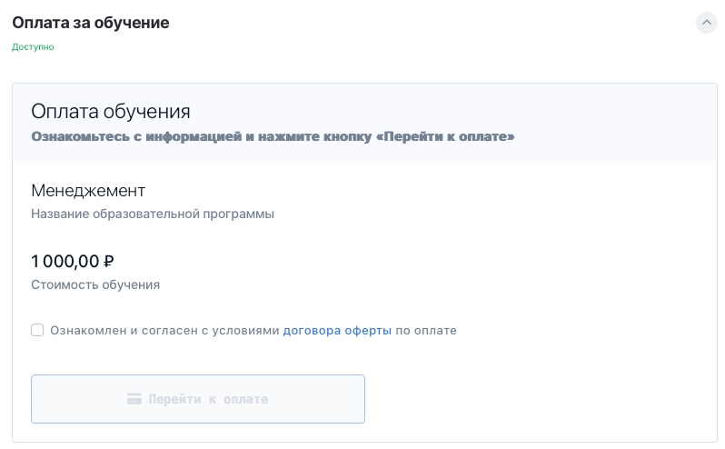
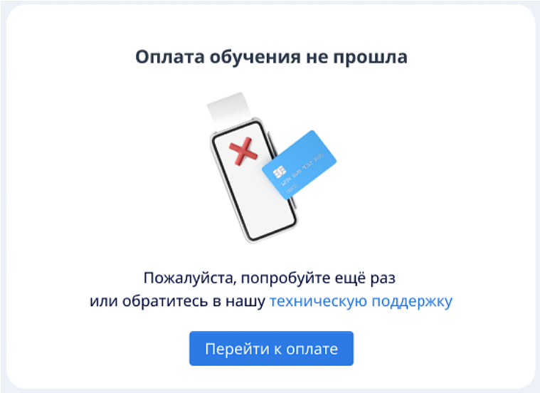
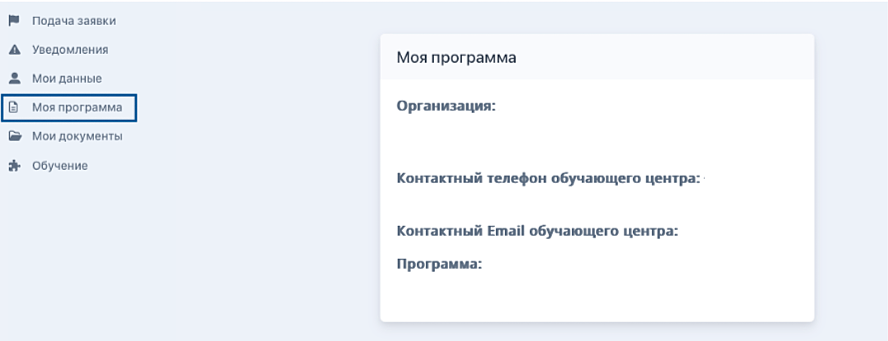

Можно оплатить онлайн из ЛК Flow (если такая возможность доступна в вашей организации) или по способу, предложенному образовательной организацией.

[tabs]

[tab:Оплата через ЛК Flow]

Если у образовательной организации подключен эквайринг, то можно оплатить обучение прямо из личного кабинета Flow.

На шаге "Оплата за обучение" есть кнопка "Перейти к оплате", которая переводит пользователя на страницу оплаты.

{width=798px height=494px}

Кнопка “Перейти к оплате” не активна, пока пользователь не отметит чек-бокс. Стоимость обучения подтягивается из программы, на которую подана заявку.

Если оплата прошла успешно, то пользователь попадает на страницу успеха, откуда можно перейти к следующему шагу.

{width=404px height=84px}

Если оплата не прошла, то осуществляется переход на страницу ошибки, откуда можно перейти к следующему шагу или обратиться в поддержку. Ошибка подсвечивается в предупредительном уведомлении: “Попробуйте ещё раз или свяжитесь со службой поддержки”.

{width=403px height=105px}

При нажатии на ссылку «техническую поддержку» пользователю откроется форма с обращением в поддержку.

{width=759px height=552px}

[/tab]

[tab:По способу организации]

Образовательная организация может предложить оплату обучения напрямую по счету, по ссылке, по QR-коду или по любому другому удобному для нее или вас способу.

Для уточнения варианта оплаты можете сами обратиться в организацию по контактам, указанным в разделе "Моя программа".

{width=888px height=341px}

Или же можете ожидать, когда с вами свяжется менеджер и предоставит перечень вариантов оплаты.

{width=800px height=157px}

[/tab]

[/tabs]