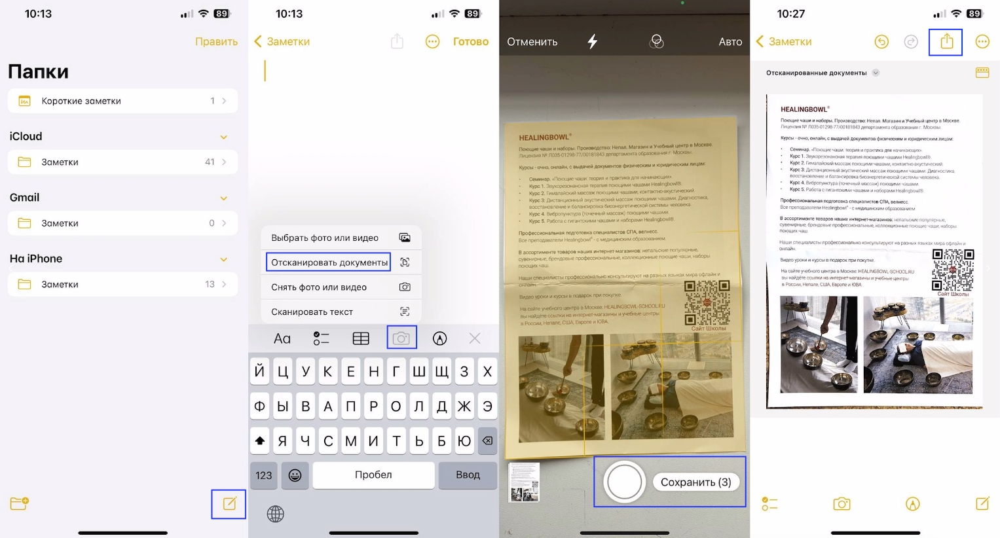
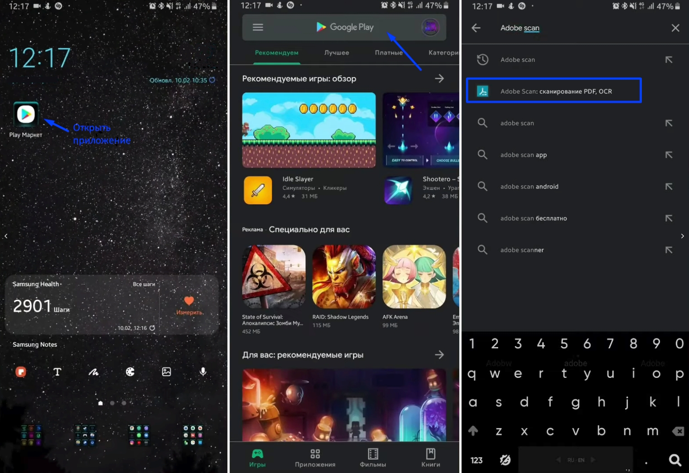
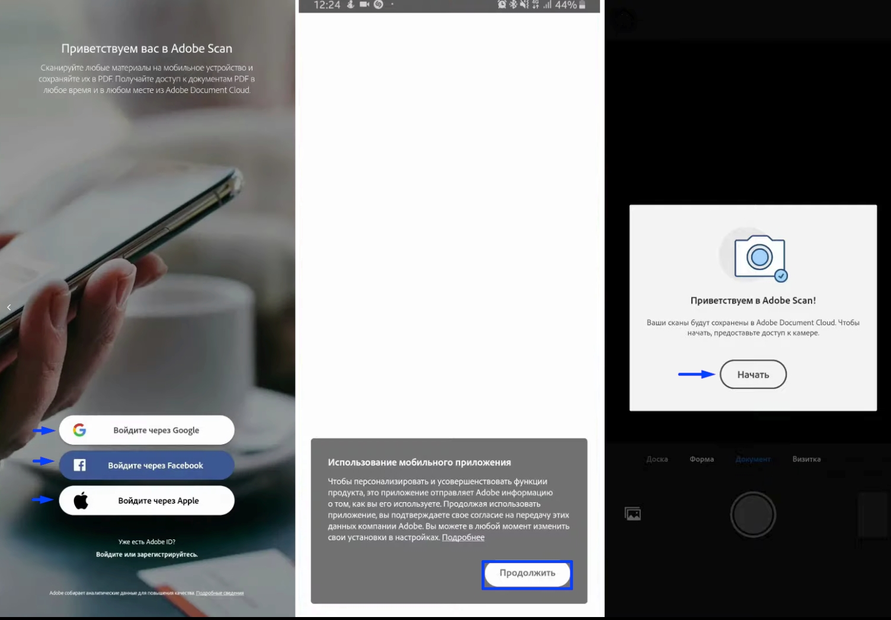
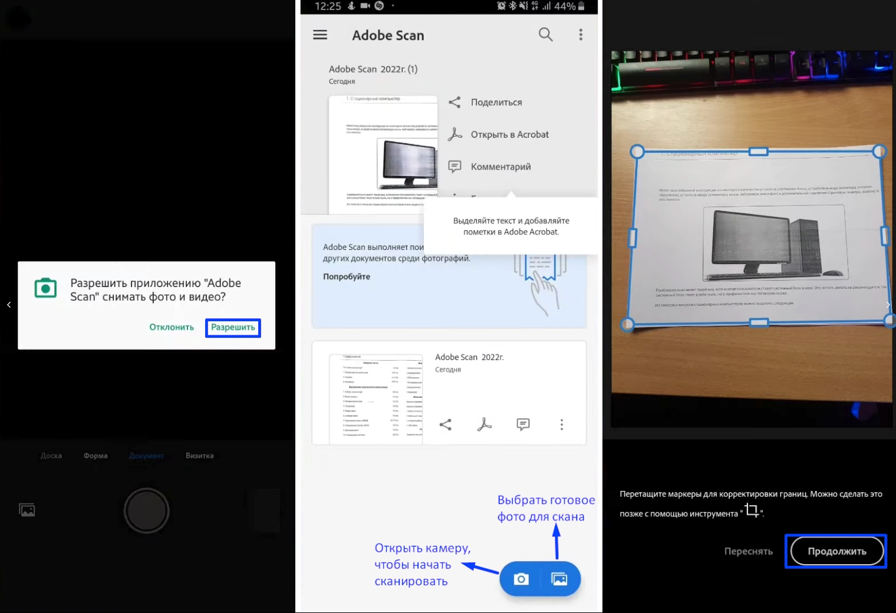
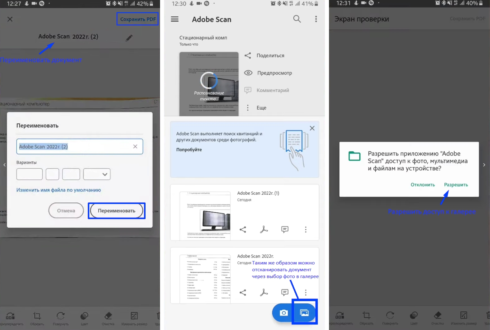
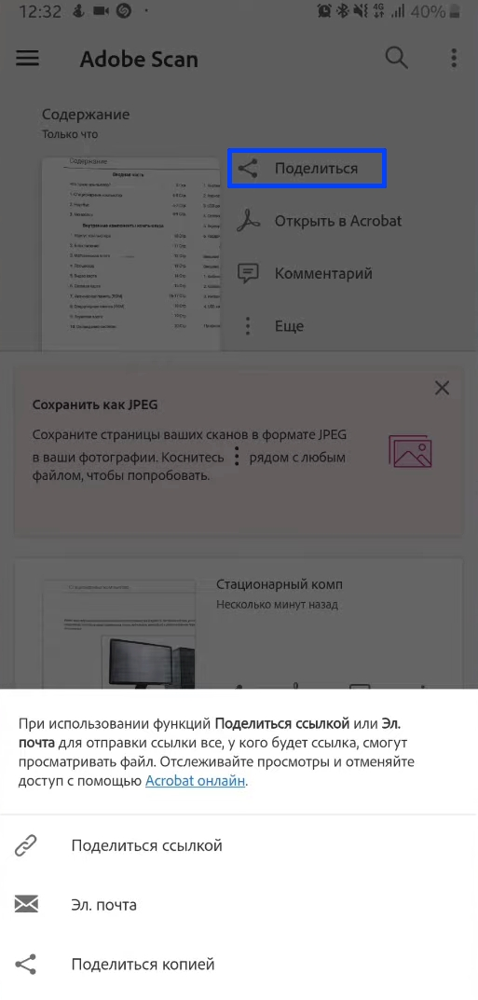

Сканирование документов – инструмент для формирования документооборота и электронного архива. Качественные сканы можно сделать на телефоне iOS и Android.

[tabs]

[tab:Notes для IOS]

Если у вас iPhone:

1\. Откройте стандартное приложение «Заметки», чтобы отсканировать документ на iPhone

2\. Создайте новую заметку или зайдите в существующую.

3\. Кликните на иконку камеры над клавиатурой и выберите «Отсканировать документы».

4\. Наведите камеру на документ и сделайте фото.

Снимок будет обработан автоматически. Фотография попадет в заметку, откуда вы сможете её сохранить.

5\. Нажмите кнопку "Сохранить"

6\. Выберите документ и нажмите кнопку Скачать в правом верхнем углу.

{width=1527px height=822px}

[/tab]

[tab:\"Adobe Scan\" для Android]

Если у вас Android:

1\. Откройте приложение "Adobe Scan" или скачайте его

в Play Market, чтобы отсканировать документ на Android.

2\. В поисковой строке Play Market введите "Adobe Scan", выберете его и скачайте на смартфон.

{width=1520px height=1044px}

3\. Войдите или зарегистрируйтесь в Adobe Scan.

4\. Подтвердите согласие на передачу данных компании Adobe.

5\. Чтобы сканы были сохранены, нажмите кнопку "Начать".

{width=1504px height=1047px}

6\. Предоставьте Adobe доступ к камере, нажав кнопку "Разрешить".

7\. Открой камеру, чтобы отсканировать документ или выберете готовое фото для скана.

8\. Направьте камеру на документ и нажмите "Продолжить".

{width=1520px height=1040px}

9\. Чтобы переименовать документ, нажмите по названию, введите новое название и нажмите кнопку "Переименовать".

10\. Нажмите кнопку "Сохранить в PDF" в правом верхнем углу. Документ будет сохранён на телефон и в облако. Скан появится в списке сканированных документов.

11\. Таким же образом можно отсканировать документ через выбранное фото в галерее. Нажмите на кнопку галереи в правом нижнем углу и выполните аналогичные действия по инструкции.

{width=1525px height=1029px}

12\. Поделитесь отсканированным документом: скопируйте ссылку, отправьте скан по электронной почте или поделитесь копией.

{width=513px height=1073px}

[/tab]

[/tabs]